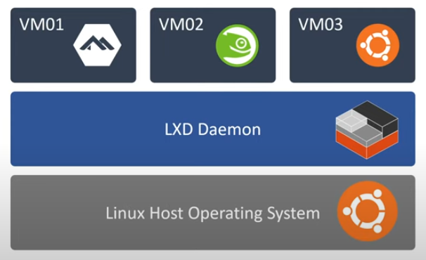

O LXC (Linux Containers) é uma tecnologia de virtualização em nível de sistema operacional que permite a execução de múltiplos ambientes Linux isolados em um único host. Diferentemente das máquinas virtuais tradicionais, o LXC compartilha o kernel do sistema hospedeiro, resultando em uma virtualização mais leve e eficiente.

O LXD (Linux Container Daemon), por sua vez, é uma camada de gerenciamento desenvolvida pela Canonical (empresa responsável pelo Ubuntu) que aprimora e expande as funcionalidades do LXC. O LXD funciona como um daemon que gerencia os contêineres, enquanto o LXC atua como o cliente. Esta arquitetura torna o sistema mais adequado para ambientes de produção, oferecendo recursos avançados como isolamento de recursos, migração de contêineres, snapshots e backups.

A história do uso de contêineres começa com o conceito de virtualização nos anos 1960, mas foi apenas em 2001 que surgiu a primeira solução robusta de contêiner, o Jails, no FreeBSD. Em 2008, o Linux passou a incluir a tecnologia LXC por padrão no Kernel. Posteriormente, em 2013, foi criado o Docker como uma camada sobre o LXC, e a Canonical lançou o LXD como sua solução própria de contêiner.

> Ilustração obtida do vídeo: [Intro to Virtual Machines With LXD on Linux
> ](https://www.youtube.com/watch?v=WsCAUQk-a3M&ab_channel=TrevorSullivan_)
